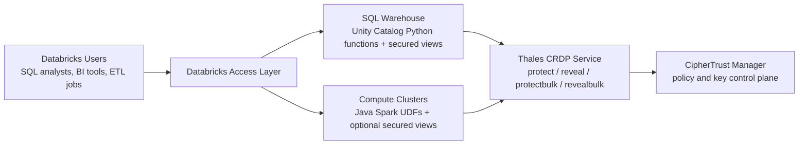

# Databricks and Thales CRDP Architecture

This is a customer-facing overview of the recommended deployment patterns for
Thales CRDP with Databricks.

## High-level architecture

## SQL Warehouse pattern

Best for:

- Databricks SQL
- dashboards and BI tools
- governed shared SQL access
- Lakeflow / SQL-centric pipelines

Recommended components:

- Unity Catalog Python functions
- secured views that inject `session_user()`
- grants on views, not direct function access

Flow:

1. User queries a secured view.
2. The view calls a `*_with_user` function.
3. The function uses `session_user()` as the reveal identity.
4. CRDP evaluates policy and returns protected or revealed data.

## Compute cluster pattern

Best for:

- Spark ETL
- high-throughput batch processing
- notebook and job execution on clusters

Recommended components:

- shaded Java jar attached to cluster
- Java Spark UDF adapters
- optional persistent SQL views for governed reveal access

Flow:

1. Spark registers Java UDFs.
2. Executors call CRDP in parallel for protect/reveal operations.
3. Optional SQL views wrap the `*_with_user` UDFs with `current_user()`.

## Security model

Recommended posture:

- keep tokenized raw tables restricted
- expose revealed data only through secured views
- do not let end users pass arbitrary reveal usernames
- grant users `SELECT` on views instead of direct function execution access

## Performance model

- use bulk functions whenever the source data shape supports it
- CRDP v1 bulk calls must use one protection policy per request
- Spark compute clusters are the best fit for high-throughput parallel ETL
- SQL Warehouse is the best fit for governed SQL and BI access

## Network placement

Recommended deployment approach:

- deploy CRDP close to Databricks in Azure
- minimize network latency between Databricks and CRDP
- CipherTrust Manager can be hybrid or centralized, but CRDP placement matters
  most for runtime performance
