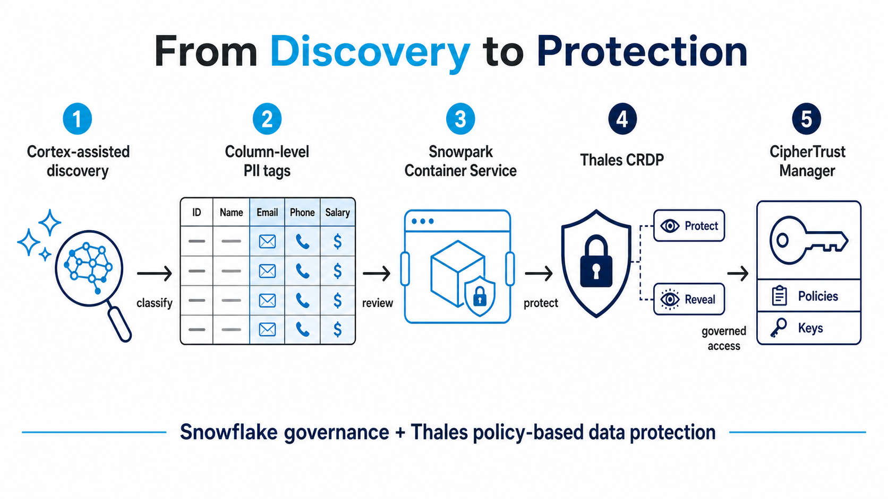
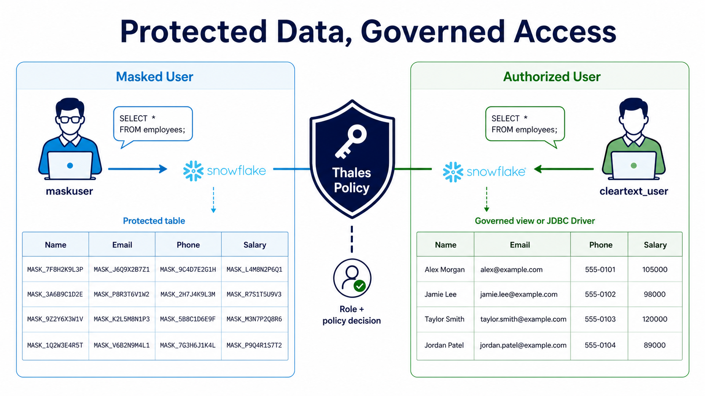

# From Discovery to Protection: Simplifying Sensitive Data Security in Snowflake with Cortex and Thales

Sensitive data does not stay in one place. It moves from customer systems to
analytics platforms, operational reports, data science workloads, and AI-driven
applications. As a result, the hard part of data protection is often not the
cryptography. It is knowing which columns need protection, applying the right
controls consistently, and giving authorized users a practical way to work with
the data without asking every team to rewrite its applications.

Snowflake and Thales can help organizations close that gap. Snowflake provides
the data platform, governance foundation, and AI-assisted experience for finding
and organizing sensitive data. Thales CipherTrust REST Data Protection (CRDP)
provides policy-based protection and reveal services, backed by customer-managed
key and encryption controls. Together, they create a repeatable workflow: find
sensitive data, classify it at the column level, protect it using centrally
managed policy, and reveal it only to the people and applications that are
authorized to see it.

> Cortex can make the workflow approachable in plain English; Thales supplies
> the security guardrail that applies protection and access policy at scale.

*Figure 1. A closed-loop sensitive-data workflow joining Snowflake governance
with Thales policy-based protection.*

## Start with what matters: identifying sensitive columns

Security programs often begin with a spreadsheet and a difficult question: where
is our personal data? That approach is slow, incomplete, and hard to maintain as
schemas change. Snowflake sensitive data classification provides a more durable
foundation. It can identify sensitive attributes, apply system-defined semantic
and privacy tags, and map those results to an organization’s own governance
tags. The result is not just a list of tables; it is column-level context that
can drive automation.

This is where Cortex can improve the operating experience for a Snowflake
security administrator. Instead of starting with a long set of manual commands,
an administrator can describe an objective in plain English, such as: “Classify
the NORTHSTAR_ANALYTICS database and apply a PII tag to detected columns.” Cortex
Code can help turn that request into the appropriate Snowflake workflow, while
the administrator reviews and approves the resulting changes.

Consider a simple Northstar Analytics environment. An `EMPLOYEES` table might
contain names, email addresses, and salary information. A `CLIENTS` table might
contain business contacts, emails, and phone numbers. Classification identifies
the columns that merit heightened handling. Tags become the contract between
governance and protection: they tell downstream automation which columns should
be protected, without hard-coding a separate list into every pipeline.

The key is to keep a human review point. Classification is a powerful starting
signal, not a substitute for the organization’s data owners and policies. Teams
can review discovered tags, refine mappings for their industry or region, and
then use approved tags to trigger the next stage.

## Turn tags into protection, with a review before execution

Once sensitive columns are tagged, a Snowflake stored procedure can use the tag
metadata to build the protection work. For character data, it calls a Thales
CRDP bulk protection function; for numeric data, it calls the appropriate
numeric-aware protection function. The procedure can discover every tagged
column across a schema, generate the required `UPDATE` statements, and apply
them consistently.

The important operational detail is a dry-run mode. Before changing a table, the
procedure returns the generated SQL for review. A security administrator can ask
Cortex to preview the planned transformation in plain language, inspect the
statements, and approve execution only when the target tables and columns are
correct. This offers a practical balance between automation and control:
automation eliminates repetitive work, while the preview preserves change
discipline.

Behind the Snowflake function, the integration can run as a Snowpark Container
Services application that sends bulk REST requests to Thales CRDP. This is useful
because protection policy stays centralized in Thales. The Snowflake workflow
does not need to embed keys, algorithms, or policy logic in every SQL statement.
The service asks CRDP to protect or reveal data using a named policy, and CRDP
enforces the configured controls.

For organizations that want a strong separation of duties, this architecture is
particularly compelling. Snowflake administrators govern data classification,
tagging, and SQL workflows. Security teams control Thales policies and key
management. Application and analytics teams use protected data through familiar
Snowflake interfaces.

## Make authorized access straightforward

Protection is only half of the journey. The next challenge is making sure that
people who are permitted to see cleartext can do so without forcing every report,
dashboard, or application to implement a custom reveal call.

One approach is to generate standard Snowflake views. A view can retain the
protected source columns and add a corresponding `_REVEALED` column that calls a
Thales reveal function. As with protection, the view-generation procedure can
first produce a dry-run preview of the `CREATE VIEW` statements. After approval,
it creates governed views consistently across the tagged tables.

This makes the access experience clear. A user such as `maskuser` can query the
protected table or a masked view and receive protected values. A user with the
appropriate Thales authorization, such as `cleartext_user`, can query the
governed reveal view and receive the original value in the `_REVEALED` column.
The decision is policy-based, rather than a scattered collection of application
exceptions.

The Thales JDBC Driver for Snowflake offers another path for teams that want to
minimize application changes. It can transform protected values for authorized
users as data is read through the driver, allowing applications to continue using
their existing JDBC access pattern. In both approaches, the aim is the same:
security controls should not require every consuming team to become a data
protection specialist.

*Figure 2. The access experience stays familiar while Thales policy determines
whether protected or authorized cleartext data is returned.*

## Control that can evolve with the security landscape

Thales supports several integration patterns for Snowflake, including REST-based
protection through Snowpark Container Services and JDBC-based transparent
transformation. Organizations can choose the model that fits their use case,
whether they prioritize SQL-native automation, transparent application access,
or the greatest level of control over encryption and keys.

Bring Your Own Encryption (BYOE) is especially relevant for organizations that
want more direct control over key custody and cryptographic choices. That
control can matter as key rotation policies mature and organizations prepare for
future cryptographic transitions, including post-quantum cryptography planning.
The right option depends on security requirements, operational model, and the
applications that consume the data; it should be evaluated with the relevant
Thales and Snowflake architecture guidance.

The larger point is simple: data protection should be a managed lifecycle, not a
one-time masking project. New tables and columns are classified, approved tags
feed policy-driven protection, authorized access is provided through views or a
driver, and teams can audit the workflow. This gives organizations a path to
broaden protection without making every data project a custom security
integration.

## A practical security guardrail for modern data teams

Snowflake Cortex can reduce the friction of finding and managing sensitive data
with natural-language assistance. Snowflake classification and tags provide the
governance signal at column level. Thales CRDP provides the protection engine,
policy enforcement, and key-centric security controls. Snowpark Container
Services brings the components together within the Snowflake environment.

The combination helps organizations move from “we think this table contains
PII” to a repeatable, reviewable process for discovering, protecting, and
governing it. That is the real value of the Thales and Snowflake partnership:
stronger control over sensitive data with less operational friction for the
teams responsible for using it.

## Implementation at a glance

1. Classify sensitive data in Snowflake and map results to a PII protection tag.

2. Use a dry-run stored procedure to preview protection statements for tagged
   columns.

3. Execute approved bulk protection calls through Snowpark Container Services
   to Thales CRDP.

4. Generate and review governed reveal views, or use the Thales JDBC Driver for
   transparent authorized transformation.

5. Maintain least-privilege Snowflake roles and Thales policies, and periodically
   review classification, protection, and reveal results.

## Further reading

- [Snowflake sensitive data classification](https://docs.snowflake.com/en/user-guide/classify-intro)
- [Snowflake classification profiles and automatic tagging](https://docs.snowflake.com/en/user-guide/classify-auto)
- [Snowflake service functions for Snowpark Container Services](https://docs.snowflake.com/en/sql-reference/sql/create-function-spcs)
- [Snowpark Container Services overview](https://docs.snowflake.com/en/developer-guide/snowpark-container-services/working-with-services)
