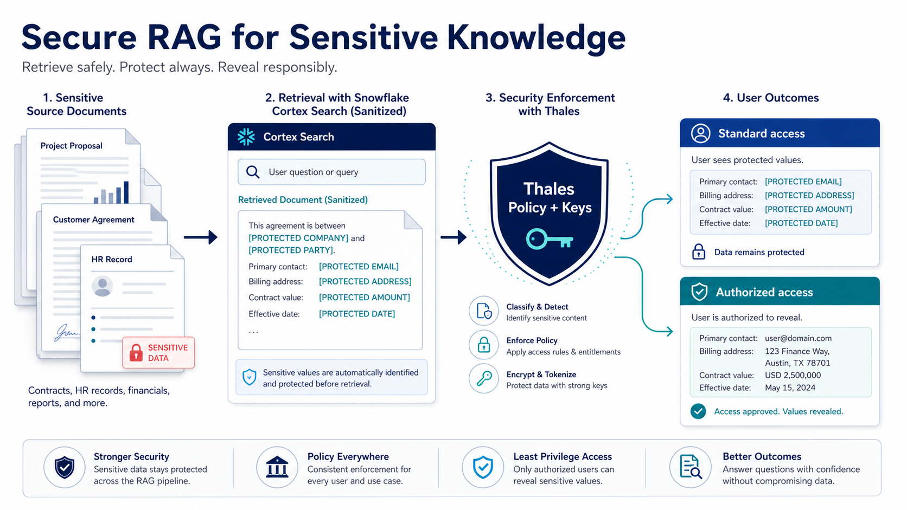

# Building Secure RAG with Snowflake Cortex Search and Thales CRDP

## A technical pattern for protecting PII before it enters retrieval context

Retrieval Augmented Generation (RAG) lets an LLM answer from enterprise
knowledge rather than from its general training data alone. A user question
retrieves relevant document passages, which are supplied to the LLM as grounded
context. Internal documents, however, can contain personal information,
compensation data, contact information, and confidential business facts.

This article describes a defense-in-depth pattern using Snowflake Cortex Search,
Snowflake document processing, Snowpark Container Services, and Thales
CipherTrust REST Data Protection (CRDP). The central control is deliberately
simple: protect sensitive values before the document becomes searchable RAG
context, then reveal values only through a separately authorized path.

1. Parse staged documents in Snowflake.
2. Identify candidate sensitive entities.
3. Protect those values through Thales CRDP.
4. Persist and index only sanitized text for RAG retrieval.
5. Return protected answers by default and reveal only when policy permits.



*Figure 1. The protection boundary is placed before the searchable RAG corpus,
not after an LLM has already received raw document content.*

## Architecture and trust boundaries

The pattern separates four responsibilities:

- **Snowflake internal stage and parsing.** Documents are uploaded to an
  internal stage with directory metadata. `PARSE_DOCUMENT` extracts text inside
  the Snowflake workflow.
- **Sensitive-data identification.** A Cortex LLM extraction prompt, a
  deterministic detector, or a combination of both produces candidate entities.
  LLM output must be validated before it drives an irreversible transformation.
- **Thales protection service.** A Snowpark Container Services endpoint calls
  CRDP bulk protection and reveal policies. The container does not contain data
  protection keys; CRDP and CipherTrust Manager retain policy and key control.
- **Sanitized RAG corpus.** The table used by Cortex Search contains document
  metadata and sanitized text. It must not retain a convenience `RAW_TEXT`
  column alongside indexed content.

Snowflake roles control access to stages, tables, search services, and
functions. Thales adds policy enforcement around the data values, including
which caller or use case may request a reveal. These controls complement rather
than replace one another.

## 1. Stage documents and extract text

An internal stage is a practical landing point for the document set. The stage
and its directory metadata let the pipeline enumerate documents without a
manually maintained file list.

```sql
CREATE OR REPLACE STAGE DOCS
  ENCRYPTION = (TYPE = 'SNOWFLAKE_SSE')
  DIRECTORY = (ENABLE = TRUE);

ALTER STAGE DOCS REFRESH;

CREATE OR REPLACE TEMPORARY TABLE TEMP_PARSED_CHUNKS AS
SELECT
  RELATIVE_PATH AS FILE_NAME,
  SNOWFLAKE.CORTEX.PARSE_DOCUMENT(
    '@DOCS', RELATIVE_PATH, {'mode': 'LAYOUT'}
  ):content::STRING AS RAW_TEXT
FROM DIRECTORY('@DOCS');
```

The temporary table is a processing boundary, not the future RAG source. Apply
least privilege to the stage and do not copy extracted cleartext to permanent
diagnostic tables, query exports, or application logs. A production design also
needs ingestion error handling, document-size limits, supported file types, and
a retention period for source files.

## 2. Detect and validate sensitive entities

The proof of concept uses `SNOWFLAKE.CORTEX.COMPLETE` to return a JSON list of
PII candidates. A prompt can ask for an extracted value and a routing class,
such as `char` for names, emails, and formatted phone numbers, or `number` for
numeric values.

```sql
SELECT SNOWFLAKE.CORTEX.COMPLETE(
  'mistral-large2',
  CONCAT(
    'Extract PII from this text. Return JSON with entity_value and detected_type. ',
    'Use number only for pure numeric values. Text: ', RAW_TEXT
  ),
  {'response_format': {'type': 'json_object'}}
) AS EXTRACTED_JSON
FROM TEMP_PARSED_CHUNKS;
```

Treat the response as candidate metadata, not infallible classification. Validate
the JSON shape, cap entity count and length, normalize duplicates, and verify
that each entity occurs in the source text. For high-risk data types, combine
LLM extraction with deterministic patterns, business dictionaries, or a human
approval queue. Record confidence and processing version in metadata, but not
raw values.

An important operational rule is to fail closed: if an entity cannot be
classified or protected, do not promote the document to the searchable corpus.
Move it to a restricted exception queue for review instead.

## 3. Protect values using Thales CRDP

The Snowflake application does not perform encryption itself. It sends batches
to the CRDP service through the Snowpark Container Services integration, and
CRDP applies the configured policy. This centralizes algorithm, key, and policy
decisions while supporting separation of duties between Snowflake administrators
and security teams.

The demonstration uses separate character and numeric protection functions. It
prefixes each returned token with application-level routing metadata, allowing a
later authorized reveal function to choose the matching CRDP policy. The
prototype uses base64-encoded `char#` and `nbr#` headers followed by a delimiter:

```text
Y2hhciM=$<protected-character-value>
bmJyIw==$<protected-numeric-value>
```

These prefixes are routing metadata, not cryptographic protection. They do not
contain cleartext, but can disclose a broad value class. Use an opaque format if
that classification is sensitive. Do not log full tokens unnecessarily, and
make sure replacement logic handles punctuation, repeated values, overlapping
matches, and SQL escaping safely.

For CRDP container-to-container calls, configure TLS using the documented
`CRDP_SSL_ENABLED`, CA certificate, and client PKCS12 settings. Store CA
certificates, client key material, and passwords in Snowflake secrets or a cloud
secrets manager. Inject them at runtime as a file or base64 value. Do not put
raw PEM, PKCS12 passwords, or certificate content in a Dockerfile, committed
service specification, application default, or query history.

## 4. Build the sanitized corpus, then create Cortex Search

After protection, reconstruct document text by replacing each raw entity with
its protected form. Persist the sanitized version and useful non-sensitive
metadata, then discard the temporary raw-text tables.

```sql
CREATE OR REPLACE TABLE PROCESSED_DOCUMENTS_RAG AS
SELECT
  FILE_NAME,
  SANITIZED_TEXT,
  CURRENT_TIMESTAMP() AS INDEXED_AT,
  'v1' AS PROTECTION_PIPELINE_VERSION
FROM TEMP_SANITIZED_DOCUMENTS;

DROP TABLE IF EXISTS TEMP_PARSED_CHUNKS;
DROP TABLE IF EXISTS TEMP_EXTRACTED_ENTITIES;
```

The proof of concept can generate embeddings manually with `EMBED_TEXT_768` and
rank results with vector similarity. That is useful for testing token
preservation and response handling. For a Cortex Search production pattern,
however, point the search service at the sanitized table rather than separately
maintaining an application-managed vector column.

```sql
CREATE OR REPLACE CORTEX SEARCH SERVICE RAG_SEARCH
  ON SANITIZED_TEXT
  ATTRIBUTES FILE_NAME
  WAREHOUSE = RAG_WH
  TARGET_LAG = '1 hour'
AS
SELECT FILE_NAME, SANITIZED_TEXT
FROM PROCESSED_DOCUMENTS_RAG;
```

Cortex Search manages the retrieval service and uses a hybrid retrieval
approach. Keeping its source sanitized means the search service and the RAG
application work from protected representation, rather than indexing cleartext
and attempting to hide it only in the final answer.

## 5. Generate a protected answer by default

At query time, search the sanitized service, build a bounded context window,
and ask the LLM to answer only from that context. The prompt should explicitly
instruct the model to preserve protected tokens exactly and not infer, fabricate,
or reveal their underlying values.

```text
Use only the supplied context. Preserve protected tokens exactly as written.
Do not infer their values. If the answer is unavailable in the context, say so.
```

This is a guardrail, not authorization control. The security property comes
from the fact that the prompt context contains protected values in the first
place. Set maximum result counts and context sizes, capture request correlation
IDs, and avoid recording full prompts or responses in broadly accessible logs.

## 6. Reveal only through an authorized path

The prototype includes a `REVEAL_TAGGED_TEXT` function that scans a protected
answer, reads routing metadata, and calls the matching Thales reveal function.
Do not make this function universally executable. Put it behind a dedicated
Snowflake role and expose it only through a controlled view, stored procedure,
or application API. Log every reveal decision.

The reveal path should check more than a user name: consider the invoking role,
application identity, data domain, request purpose, and time-bound approval.
Align the Thales policy to the same model so authorization exists at both the
Snowflake invocation point and the data protection service. If a reveal fails,
preserve the protected token rather than leaking context in an error or silently
substituting a guessed value.

### Same question, two governed outcomes

The following fictional example shows the desired default behavior. The RAG
answer remains useful to any permitted user, but only an authorized role may
invoke the reveal path to obtain the cleartext values.

**Protected response (any permitted role)**

- Sarah Conner: total compensation package mapped to
  `bmJyIw==$71425 USD`
- Michael Scott: current salary established at `bmJyIw==$10015 USD`

**Revealed response (authorized roles only)**

- Sarah Conner: total compensation package mapped to `92000 USD`
- Michael Scott: current salary established at `88000 USD`

## Operational controls for a production rollout

- **TLS and secrets:** Use mTLS where required, verify certificates, rotate
  client credentials, and never disable certificate verification outside
  controlled testing.
- **Idempotency:** Store a document hash and protection-pipeline version so a
  retry does not repeatedly protect already protected content.
- **Access control:** Grant minimum privileges to the stage, source table,
  Cortex Search service, protection function, and reveal function.
- **Observability:** Record document ID, pipeline version, entity counts,
  logical policy route, status, and correlation ID. Keep raw text and full
  tokens out of routine logs.
- **Quality evaluation:** Test extraction recall and precision, replacement
  correctness, retrieval relevance, answer faithfulness, and reveal
  authorization with representative documents.
- **Retention:** Define when original staged files, temporary parsed text,
  sanitized documents, and audit records are retained or purged.

## A reusable security pattern for enterprise AI

The strength of this design is where it puts the control. Sensitive values are
protected before documents become a retrieval corpus, so the default AI path
works with information that remains useful but is less exposed. Snowflake Cortex
Search provides managed retrieval, Snowpark Container Services hosts the CRDP
integration close to Snowflake workloads, and Thales controls the protection and
reveal policy around the values that require the most care.

This provides a practical foundation for document assistants designed for the
access, sovereignty, and audit requirements of enterprise data.

## Further reading

- [Snowflake: Ask questions of your own documents with Cortex Search](https://www.snowflake.com/en/developers/guides/ask-questions-to-your-own-documents-with-snowflake-cortex-search/)
- [Snowflake Cortex Search overview](https://docs.snowflake.com/en/user-guide/snowflake-cortex/cortex-search/overview)
- [Snowflake Cortex Search access control](https://docs.snowflake.com/en/user-guide/snowflake-cortex/cortex-search/access-control)
- [Snowflake PARSE_DOCUMENT](https://docs.snowflake.com/en/sql-reference/functions/parse_document-snowflake-cortex)
- [Thales CipherTrust RESTful Data Protection](https://cpl.thalesgroup.com/encryption/ciphertrust-restful-data-protection)
